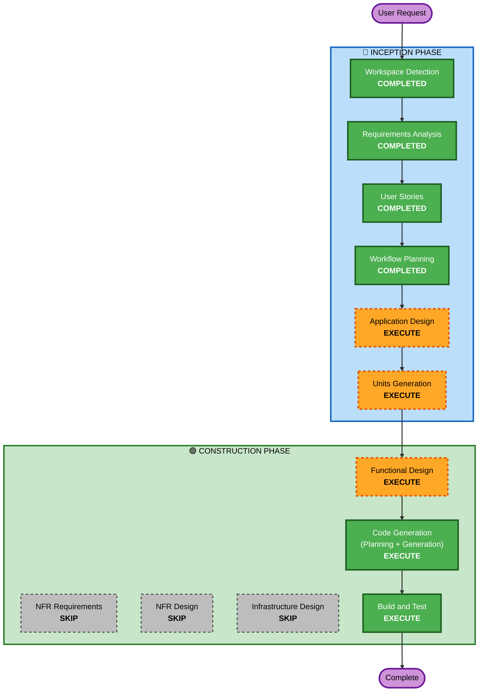

# Execution Plan — Expense Calculator App

## Detailed Analysis Summary

### Change Impact Assessment
- **User-facing changes**: Yes — entire application is new user-facing mobile app
- **Structural changes**: Yes — new Flutter project structure with multiple layers (UI, BLoC/state, data, services)
- **Data model changes**: Yes — new Hive/Isar data models for expenses, categories, settings
- **API changes**: No — no backend APIs, purely local app
- **NFR impact**: Yes — performance targets, local encryption, biometric integration

### Risk Assessment
- **Risk Level**: Medium — multiple features (SMS parsing, charts, export, auth) but well-understood domain
- **Rollback Complexity**: Easy — greenfield, no existing system to break
- **Testing Complexity**: Moderate — SMS parsing, data persistence, and export require thorough testing

---

## Workflow Visualization



### Text Alternative
```
Phase 1: INCEPTION
- Workspace Detection (COMPLETED)
- Requirements Analysis (COMPLETED)
- User Stories (COMPLETED)
- Workflow Planning (COMPLETED)
- Application Design (EXECUTE)
- Units Generation (EXECUTE)

Phase 2: CONSTRUCTION
- Functional Design (EXECUTE, per-unit)
- NFR Requirements (SKIP)
- NFR Design (SKIP)
- Infrastructure Design (SKIP)
- Code Generation (EXECUTE, per-unit)
- Build and Test (EXECUTE)
```

---

## Phases to Execute

### 🔵 INCEPTION PHASE
- [x] Workspace Detection (COMPLETED)
- [x] Requirements Analysis (COMPLETED)
- [x] User Stories (COMPLETED)
- [x] Workflow Planning (COMPLETED)
- [ ] Application Design - EXECUTE
  - **Rationale**: New app needs component identification, service layer design, state management decisions, and dependency mapping
- [ ] Units Generation - EXECUTE
  - **Rationale**: Multiple feature areas (SMS, UI, data, export, auth) benefit from structured unit decomposition for focused implementation

### 🟢 CONSTRUCTION PHASE
- [ ] Functional Design - EXECUTE (per-unit)
  - **Rationale**: Business logic for SMS parsing, expense categorization, report generation, and export formatting needs detailed design
- [ ] NFR Requirements - SKIP
  - **Rationale**: NFRs are straightforward (performance targets, local storage encryption) and already captured in requirements. No complex NFR trade-offs needed for a local mobile app.
- [ ] NFR Design - SKIP
  - **Rationale**: Skipped because NFR Requirements is skipped. Performance and security patterns are standard Flutter practices that can be handled during code generation.
- [ ] Infrastructure Design - SKIP
  - **Rationale**: Purely local mobile app with no cloud infrastructure, no servers, no deployment pipelines beyond app store. Not applicable.
- [ ] Code Generation - EXECUTE (per-unit, ALWAYS)
  - **Rationale**: Implementation planning and code generation required for each unit
- [ ] Build and Test - EXECUTE (ALWAYS)
  - **Rationale**: Build verification and test instructions required

### 🟡 OPERATIONS PHASE
- [ ] Operations - PLACEHOLDER

---

## Success Criteria
- **Primary Goal**: Working Flutter expense calculator app for Android with all 26 user stories implemented
- **Key Deliverables**: 
  - Flutter project with clean architecture
  - SMS parsing service with generic pattern matching
  - Dashboard with charts and visualizations
  - Weekly/monthly report generation
  - Excel and PDF export functionality
  - PIN and biometric authentication
  - Hive/Isar local database with all data models
- **Quality Gates**:
  - App builds successfully for Android
  - All core user flows functional
  - Data persists across app restarts
  - Export generates valid Excel and PDF files

---

## Estimated Stages Remaining: 5
(Application Design → Units Generation → Functional Design → Code Generation → Build and Test)
